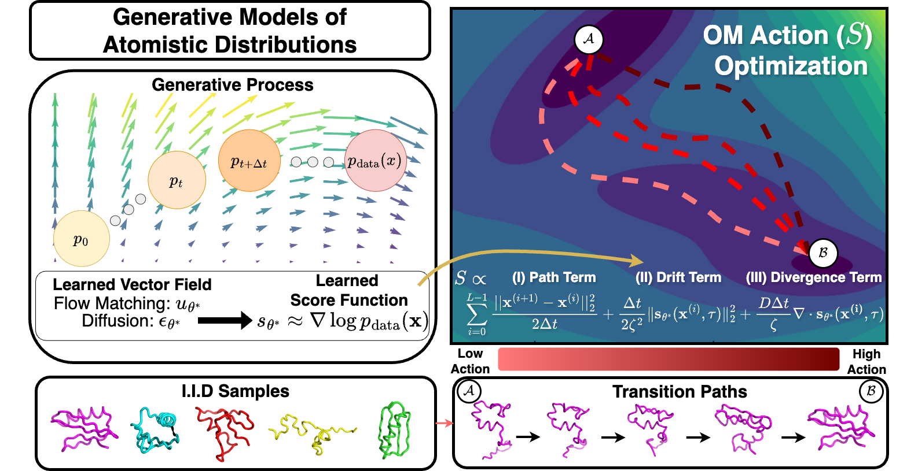

# [ICML 2025] Action-Minimization Meets Generative Modeling: Efficient Transition Path Sampling with the Onsager-Machlup Functional
<p align="center">
  <a href="https://arxiv.org/abs/2504.18506">
    
  </a>
</p>

Official implementation of **"Action-Minimization Meets Generative Modeling: Efficient Transition Path Sampling with the Onsager-Machlup Functional"**, by Sanjeev Raja, Martin Šípka, Michael Psenka, Tobias Kreiman, Michal Pavelka, and Aditi S. Krishnapriyan. 

<p align="center">

</p>
<p align="center">
</p>

We introduce a method to zero-shot repurpose pretrained generative models of atomistic conformational ensembles to produce dynamical transition pathways, by interpreting candidate paths as a realization of an SDE induced by the learned score function of the generative model. We then use the Onsager-Machlup (OM) action to find maximum likelihood paths under this SDE. Our approach is compatible with any diffusion or flow matching generative model that can produce i.i.d conformational samples of a molecular system.


## Environment Setup

Create a primary conda environment:
```bash
mamba create -n om-tps python=3.9
conda activate om-tps
pip install numpy==1.21.2 pandas==1.5.3
pip install torch==1.12.1+cu113 -f https://download.pytorch.org/whl/torch_stable.html
pip install mdtraj==1.9.9 biopython==1.79
pip install wandb==0.18.7 dm-tree einops torchdiffeq fair-esm pyEMMA
pip install ase torch-geometric rmsd tqdm gsd black flow_matching scienceplots ema-pytorch tensorboard jupyter
pip install matplotlib==3.7.2 numpy==1.21.2
```

**Note:** Anytime you install a new package that causes numpy to be upgraded, make sure to revert to numpy==1.21.2 (for compatibility with pyemma)

Create a separate environment for energy evaluations with OpenMM (not compatible with the above environment due to version sensitivity):
```bash
mamba create -n openmm-env python=3.9
conda activate openmm-env
pip install numpy==1.21.2 pandas==1.5.3 rmsd mdtraj matplotlib tqdm gsd IPython
pip install torch==1.12.1+cu113 -f https://download.pytorch.org/whl/torch_stable.html
mamba install conda-forge::pdbfixer
```


## General Code Structure
The ```muller-brown/``` directory contains code to reproduce the results from the paper on the 2D Muller-Brown potential. The ```two-for-one-diffusion/``` directory contains code to reproduce the results from the paper on D.E.Shaw fast folding proteins and tetrapeptides. See the ```README.md``` in these directories for more specific instructions.


<!-- ## Training:
Run the following:
python main_train.py \
    --mol trp_cage \ # change to your protein of interest
    --data_folder /data/sanjeevr/Reference_MD_Sims \
    --eval_interval 1000 \ # how often to checkpoint
    --experiment_name name \ # replace with your name
    --start_from_last_saved False \ # whether to load from previous checkpoint
    --hidden_features_gnn 64 \
    --atom_selection c-alpha \ # coarse-graining
    --learning_rate 4e-4 \
    --min_lr_cosine_anneal 0 \ -->


## Citation
If you use this code in your research, please cite our paper.

```bibtex
@inproceedings{raja2025action,
  title={Action-Minimization Meets Generative Modeling: Efficient Transition Path Sampling with the Onsager-Machlup Functional},
  author={Raja, Sanjeev and {\v{S}}{\'\i}pka, Martin and Psenka, Michael and Kreiman, Tobias and Pavelka, Michal and Krishnapriyan, Aditi S},
  booktitle={Proceedings of the 42nd International Conference on Machine Learning (ICML)},
  year={2025},
  organization={PMLR}
}